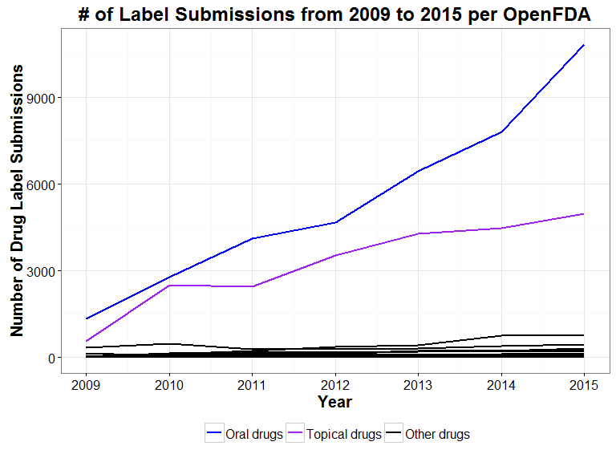
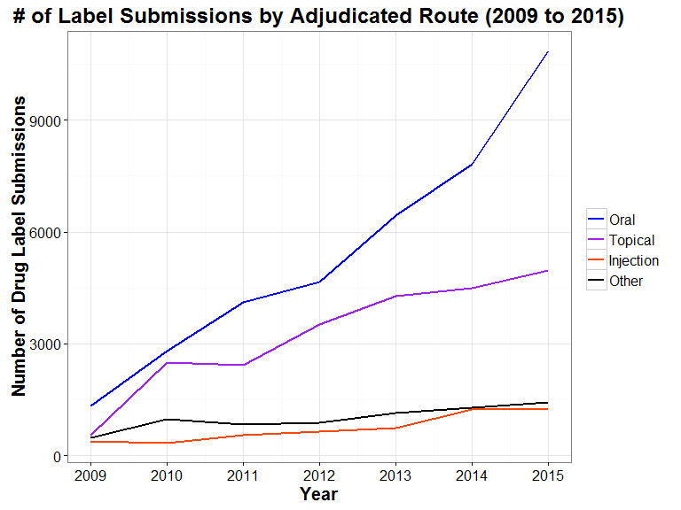
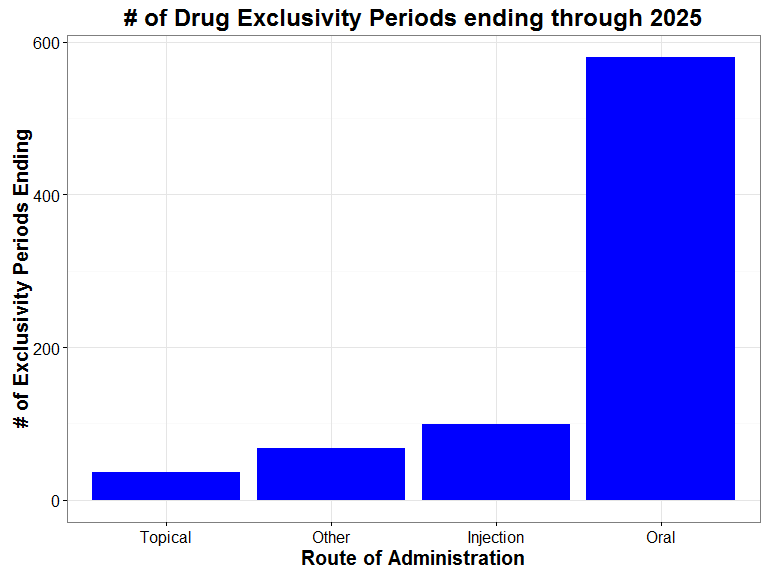

# Data Incubator Challenge 3

## Overview
The project is an evaluation of current drug shortages reported by the FDA.  The analysis was conducted using R as implemented via Rstudio.  Key packages included dplyr, ggplot2, rvest and openfda. 

## Challenge Output  

 Although the figures are provided below, the complete proposal, with all text, figures and tables, is present in the [challenge3.md markdown file](https://github.com/b3berg/DIchallenge/blob/master/challenge3.md). Please refer to that document for your assessment.

## Project Code
For the full code utilized for the analysis, please refer to the [challenge3.rmd Rmarkdownfile](https://github.com/b3berg/DIchallenge/blob/master/challenge3.rmd).  

## Figures
### Figure 1

 
 
### Figure 2

 
 
### Figure 3

 
 
### Figure 4

 
 
### Figure 5

 

