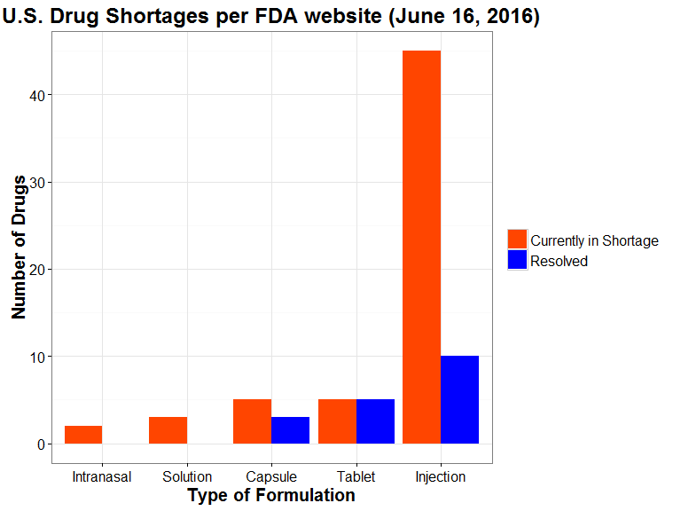
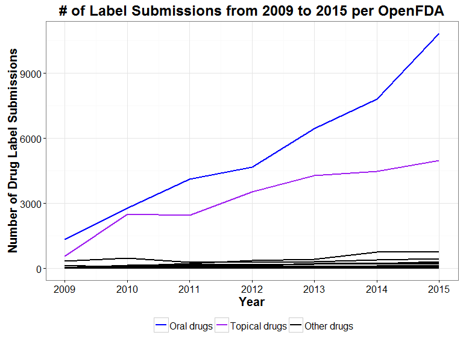
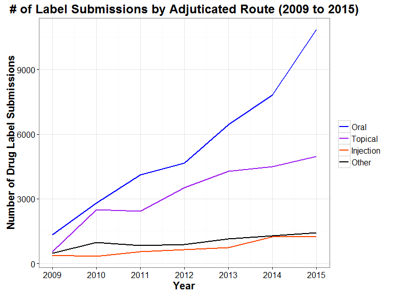
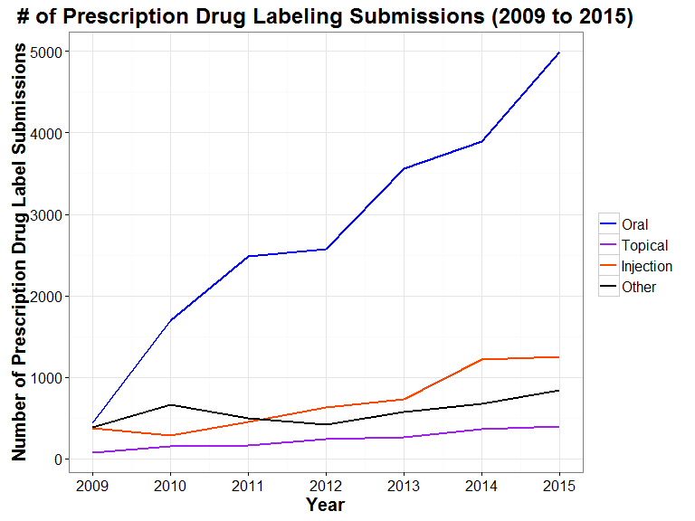
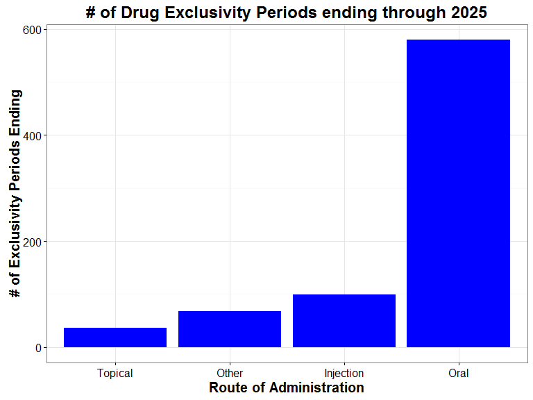

# DI Challenge
Alexander Berg, PharmD, PhD  
`r Sys.Date()`  


# Data Incubator Project Proposal

## Project - Evaluation of market opportunity in U.S. drug shortages

### Background  

In the U.S., drug shortages represent a challenge to the delivery of adequate healthcare due to the lack of accessibility of drugs by prescribers and patients.  Drug shortages are considered a national healthcare risk and as such are tracked by the [U.S. Food and Drug Administration](http://www.fda.gov/Drugs/DrugSafety/DrugShortages/default.htm) in order to inform the public and help to prevent the interruption of drug delivery to patients. Moreover, drug shortages that arise secondary to market withdrawal by certain mainfacturers can result in a monopoly of goods, which can promote unethical pricing behavior as evidenced by the recent scandal involving [Turing Pharmaceuticals](http://fortune.com/2015/09/21/turing-pharmaceuticals-drug-prices-daraprim/).

### Project Hypothesis

As the majority of shortages occur for drugs that are off-patent, drug shortages represent a failure in the generic drug marketplace.  It is proposed in this project that drug shortages may in fact be an investment opportunity for generic drug manufacturers to diversify their product portfolio while serving the greater good by ensuring availablity of important drugs and promoting competition in the marketplace.

#### Question 1 - What is the current status of drug shortages?

In order to understand the current situation, drug shortage information was obtained by table scraping from the [U.S. Food and Drug Administration drug shortage website ](http://www.accessdata.fda.gov/scripts/drugshortages/default.cfm).  


The overall number of current shortages indicated by the U.S. FDA is 60 as of June 16, 2016 (Table 1).   
  
  
  
  
##### Table 1: Drug shortages per U.S. FDA (June 16, 2016)


Table: 

drug                                                                         status               
---------------------------------------------------------------------------  ---------------------
ACETOHYDROXAMIC ACID (LITHOSTAT) TABLETS                                     Currently in Shortage
AMMONIUM CHLORIDE INJECTION                                                  Currently in Shortage
ANAGRELIDE HYDROCHLORIDE CAPSULES                                            Currently in Shortage
APREPITANT (EMEND) CAPSULES                                                  Resolved             
ATROPINE SULFATE INJECTION                                                   Currently in Shortage
AZATHIOPRINE TABLET                                                          Resolved             
BLEOMYCIN SULFATE FOR INJECTION                                              Currently in Shortage
CAFFEINE ANHYDROUS (125MG/ML); SODIUM BENZOATE (125MG/ML) INJECTION          Currently in Shortage
CALCIUM CHLORIDE INJECTION, USP                                              Currently in Shortage
CALCIUM GLUCONATE INJECTION                                                  Currently in Shortage
CEFAZOLIN INJECTION                                                          Resolved             
CEFEPIME INJECTION                                                           Currently in Shortage
CEFOTAXIME SODIUM (CLAFORAN) INJECTION                                       Currently in Shortage
CEFOTETAN DISODIUM INJECTION                                                 Currently in Shortage
CHLORAMPHENICOL SODIUM SUCCINATE INJECTION                                   Currently in Shortage
CHLOROQUINE PHOSPHATE TABLETS                                                Resolved             
DESMOPRESSIN ACETATE INJECTION                                               Currently in Shortage
DEXAMETHASONE SODIUM PHOSPHATE INJECTION                                     Currently in Shortage
DEXTROSE 5% INJECTION BAGS                                                   Currently in Shortage
DEXTROSE INJECTION USP, 70%                                                  Currently in Shortage
DIHYDROERGOTAMINE MESYLATE INJECTION                                         Currently in Shortage
DISOPYRAMIDE PHOSPHATE (NORPACE) CAPSULES                                    Currently in Shortage
DOXORUBICIN (ADRIAMYCIN) INJECTION                                           Resolved             
DOXORUBICIN LYOPHILIZED POWDER FOR INJECTION                                 Currently in Shortage
EPINEPHRINE INJECTION                                                        Currently in Shortage
EPTIFIBATIDE (INTEGRILIN) INJECTION                                          Resolved             
ETHIODIZED OIL (LIPIODOL) INJECTION                                          Currently in Shortage
FENTANYL CITRATE (SUBLIMAZE) INJECTION                                       Currently in Shortage
FOMEPIZOLE INJECTION                                                         Currently in Shortage
GEMIFLOXACIN MESYLATE (FACTIVE) TABLETS                                      Currently in Shortage
HALOPERIDOL LACTATE INJECTION                                                Resolved             
IMIPENEM AND CILASTATIN FOR INJECTION, USP                                   Currently in Shortage
INDIGOTINDISULFONATE SODIUM (INDIGO CARMINE) INJECTION                       Currently in Shortage
KETOROLAC TROMETHAMINE INJECTION                                             Resolved             
L-CYSTEINE HYDROCHLORIDE INJECTION                                           Currently in Shortage
LEUCOVORIN CALCIUM LYOPHILIZED POWDER FOR INJECTION                          Currently in Shortage
LEUPROLIDE ACETATE INJECTION                                                 Currently in Shortage
LEVETIRACETAM (KEPPRA) INJECTION                                             Resolved             
LIDOCAINE HYDROCHLORIDE (XYLOCAINE) INJECTION                                Currently in Shortage
LIFECARE PCA™ STERILE EMPTY VIAL AND INJECTOR                                Currently in Shortage
LIOTRIX (THYROLAR) TABLETS                                                   Currently in Shortage
MECASERMIN [RDNA ORIGIN] (INCRELEX) INJECTION                                Currently in Shortage
MEMANTINE HYDROCHLORIDE (NAMENDA) XR CAPSULES                                Resolved             
MEROPENEM FOR INJECTION, USP                                                 Resolved             
METHYLDOPATE HYDROCHLORIDE INJECTION                                         Currently in Shortage
METHYLPHENIDATE HYDROCHLORIDE ER CAPSULES/TABLETS                            Resolved             
METHYLPREDNISOLONE SODIUM SUCCINATE FOR INJECTION, USP                       Currently in Shortage
METOPROLOL INJECTION                                                         Resolved             
MORPHINE SULFATE INJECTION, USP, CII, (PRESERVATIVE-FREE)(FOR PCA USE ONLY)  Currently in Shortage
MULTI-VITAMIN INFUSION (ADULT AND PEDIATRIC)                                 Currently in Shortage
MUPIROCIN CALCIUM NASAL OINTMENT                                             Currently in Shortage
NEBIVOLOL (BYSTOLIC) TABLETS                                                 Resolved             
NIMODIPINE (NYMALIZE) ORAL SOLUTION                                          Currently in Shortage
PENICILLIN G BENZATHINE (BICILLIN L-A) INJECTION                             Currently in Shortage
PERITONEAL DIALYSIS SOLUTIONS                                                Currently in Shortage
PHENTOLAMINE MESYLATE INJECTION                                              Resolved             
PIPERACILLIN AND TAZOBACTAM (ZOSYN) INJECTION                                Currently in Shortage
POTASSIUM ACETATE INJECTION, USP                                             Resolved             
POTASSIUM CHLORIDE INJECTION                                                 Currently in Shortage
RESERPINE TABLETS                                                            Currently in Shortage
SACROSIDASE (SUCRAID) ORAL SOLUTION                                          Currently in Shortage
SODIUM ACETATE INJECTION, USP                                                Currently in Shortage
SODIUM BICARBONATE INJECTION, USP                                            Currently in Shortage
SODIUM CHLORIDE 0.9% INJECTION BAGS                                          Currently in Shortage
SODIUM CHLORIDE 23.4% INJECTION                                              Currently in Shortage
SUFENTANIL CITRATE (SUFENTA) INJECTION                                       Currently in Shortage
SUMATRIPTAN (IMITREX) NASAL SPRAY                                            Currently in Shortage
TECHNETIUM TC99M SUCCIMER INJECTION (DMSA)                                   Currently in Shortage
THEOPHYLLINE EXTENDED RELEASE TABLETS AND CAPSULES                           Currently in Shortage
TIGECYCLINE (TYGACIL) INJECTION                                              Currently in Shortage
TIOPRONIN (THIOLA)                                                           Resolved             
TOBRAMYCIN INJECTION                                                         Currently in Shortage
TRETINOIN CAPSULES                                                           Currently in Shortage
TRIAMCINOLONE HEXACETONIDE INJECTABLE SUSPENSION (ARISTOSPAN)                Currently in Shortage
TRIMIPRAMINE MALEATE (SURMONTIL) CAPSULES                                    Currently in Shortage
VANCOMYCIN HYDROCHLORIDE FOR INJECTION, USP                                  Currently in Shortage

It is apparent per the table that there is a large representation of drugs that are administered as an injection.  This is seen in the following figure:

<!-- -->

  
  
The figure demonstrates that the vast majority of shortages are in injectable drugs.  However, it is also worth noting that the resolution status of the injectables is much lower than those for the capsules and tablets with only 18.2% of the total shortages resolved for injectables. 

#### Question 2 - Are injectable drug approvals increasing to address drug shortages?

The data of Figure 1 suggests that despite continued shortages, the ability to meet demand may not be as high in for injectable drugs as compared to other dosage forms.  In order to evaluate this hypothesis, it was considered that the FDA approvals would show a similar trend, such that less activity would be noted for injection drugs as compared to the other dosage forms.    

To evaluate this, queries of the [openFDA labels database](https://open.fda.gov/drug/label/) were made to look at trends in regulatory labeling submissions as a surrogate for overall new drug applications.  Queries were made using the R package "openfda" in order to access the openFDA API.  The following queries were used:


```r
#Obtain list of routes in the FDA database
fda_query("/drug/label.json") %>%
           fda_api_key(apikey) %>%
           fda_count("openfda.route.exact")%>%
           fda_exec()

#Extract label submissions vs. time
fda_query("/drug/label.json") %>%
          fda_api_key(apikey) %>%
          fda_filter("openfda.route.exact","route") %>%
          fda_count("effective_time")%>%
          fda_exec()
```

Following download, the data was truncated from 2009 (since start of the structured product labeling format used by openFDA) and the number of submissions by route of administration calculated per year.  The results of the queries are shown in the following figure, which highlights the two categories with the most activity, oral and topical drugs, from all other drugs: 


<!-- -->

A naive look at the query results could lead one to conclude that there is very little activity in the area of injectable drug development.  However, inspection of the routes retrived from FDA shows that the listing of routes of administration is extensive:


```
##  [1] "ORAL"                    "TOPICAL"                
##  [3] "INTRAVENOUS"             "RESPIRATORY(INHALATION)"
##  [5] "DENTAL"                  "OPHTHALMIC"             
##  [7] "INTRAMUSCULAR"           "SUBCUTANEOUS"           
##  [9] "RECTAL"                  "NASAL"                  
## [11] "SUBLINGUAL"              "CUTANEOUS"              
## [13] "TRANSDERMAL"             "VAGINAL"                
## [15] "INTRADERMAL"             "AURICULAR(OTIC)"        
## [17] "INFILTRATION"            "EPIDURAL"               
## [19] "INTRA-ARTICULAR"         "INTRATHECAL"            
## [21] "PARENTERAL"              "PERCUTANEOUS"           
## [23] "IRRIGATION"              "INTRALESIONAL"          
## [25] "PERINEURAL"              "BUCCAL"                 
## [27] "INTRA-ARTERIAL"          "INTRAOCULAR"            
## [29] "INTRACAUDAL"             "INTRAVASCULAR"          
## [31] "INTRACARDIAC"            "PERIODONTAL"            
## [33] "EXTRACORPOREAL"          "TRANSMUCOSAL"           
## [35] "INTRASPINAL"             "INTRAPLEURAL"           
## [37] "INTRASYNOVIAL"           "INTRAPERITONEAL"        
## [39] "ENDOTRACHEAL"            "RETROBULBAR"            
## [41] "OROPHARYNGEAL"           "INTRAVITREAL"           
## [43] "NASOGASTRIC"             "INTRAVESICAL"           
## [45] "INTRAUTERINE"            "INTRABRONCHIAL"         
## [47] "SUBARACHNOID"            "INTRACAVITARY"          
## [49] "INTRACAVERNOUS"          "URETERAL"               
## [51] "INTRAVENTRICULAR"        "ENTERAL"                
## [53] "URETHRAL"                "SUBMUCOSAL"             
## [55] "SUBCONJUNCTIVAL"         "INTRALYMPHATIC"         
## [57] "SUBGINGIVAL"             "INTRATUMOR"             
## [59] "INTRANODAL"              "INTRAGINGIVAL"          
## [61] "INTRAGASTRIC"            "INTRABURSAL"            
## [63] "INTERSTITIAL"            "ENDOSINUSIAL"           
## [65] "CONJUNCTIVAL"
```

As seen in the list of routes, it is obvious that injectable drugs fall in a variety of subcategories which are used by OpenFDA for classification.  Consequently, the routes were adjudicated on the basis of medical knowledge (I should note that I am a registered pharmacist) and the output re-analyzed:


<!-- -->

Although the figure now is less noisy, it still shows the same trend that labeling submissions to the FDA for injectables are lower than the other categories in every year since 2009 and do not show the same growth trajectory as oral and topical drugs.  While this suggests that there is may be an upside to investment in this route of administration by generic manufacturers, it is noted that this data contains both prescription and over-the-counter (OTC) drugs.  This may be skewing the data as the volume of label submissions for OTC drugs is expected to be high due to frequent changes in combination products and branding.  Moreover, many generic manufacturers do not develop or market OTC drugs and thus this may not represent the "true" volume of regulatory submissions for evaluation.  Therefore, in order to have a more direct comparison of the regulatory labeling activity, the queries were re-run to filter for prescription drugs only, with the results shown in the following figure:


<!-- -->

After exclusion of OTC drugs, this figure tells a somewhat different story.  While the overall volume of labeling submissions for injectables is essentially unchanged - which is not surprising given the paucity of OTC drugs that are injectables - the relative proportion compared to the other products is markedly different.  Injectables showed the second highest number of labeling submissions in 2015, roughly twice all other non-oral routes combined, but remains significantly lower than oral dosage forms.  As many generic drug manufacturers focus on oral dosage forms such as capsules and tablets, many companies would not be equipped to cover the formulation development needs associated with injectables. However, the above data suggests that diversification of generic drug manufacturers into injectables may be warranted to alleviate the shortage in injectable drugs.

#### Question 3 - What are the market opportunities for the development of new generic injectables?

It is possible that the shortages of injectable drugs, while currently unresolved, may in fact already be in the process of correction.  This is because, despite the advent of the Generic Drug User Fee Act (GDUFA), FDA review timelines for generic drugs are [still on the order of 1 year](http://www.raps.org/Regulatory-Focus/News/2016/03/30/24676/FDA-to-Congress-GDUFA-is-Working/) and thus it is unclear if there are generic drug applications (ANDAs) that may already be in progress.  

In order to make an investment, generic drug companies will have to ensure that the market potential of injectable drugs remains viable even beyond addressing the current shortages.  To explore this possibility, data on the expiration of market drug exclusivity was downloaded from the [FDA Orange Book](http://www.fda.gov/Drugs/InformationOnDrugs/ucm129689.htm) and merged with OpenFDA queries to obtain the routes of administration for the drugs with pending expiration of exclusivity periods.  


**Note** - Although approximately half of the queries ran successfully, there were many that failed to locate the corresponding application number.  This is likely due to inconsistent formatting of application numbers within the OpenFDA database.  Consequently, this assessment is considered exploratory only and would need to be re-run for a more comprehensive evaluation.


The number of exclusivity periods (note - there may be more than one per drug) through 2025 are shown in the following table and figure:


##### Table 2. Number of Exclusivity Expirations through 2025 by Route


category   expirations
---------  -----------
Topical             36
Other               68
Injection           99
Oral               580

<!-- -->

Based on the above, it is suggested that even if the current shortages do not last, there may still be an advantage for generic manufacturers which specialize in oral drugs to expand into injectables as there are ~100 new injectable drugs with exclusivity periods ending prior to 2025.  As this is likely an underestimate (refer to earlier note about unreturned queries), the data suggests that there may be multiple opportunities for development of new generics for injectable drugs for which the exclusivity period has expired. 

### Future Directions

This project represents an exploratory feasibility assessment which requires more work to evaluate.  

Future work would include at a minimum:  

* Accounting for factors underlying injectable drug shortages
* Evaluation of the overall competitive landscape forecast for injectable drugs
* Assessment of factors that impact the net present value (NPV) of an injectable to inform development cost/profit for a portfolio of injectable drugs. 

  
  
    

```
## Session info --------------------------------------------------------------
```

```
##  setting  value                       
##  version  R version 3.2.2 (2015-08-14)
##  system   x86_64, mingw32             
##  ui       RTerm                       
##  language (EN)                        
##  collate  English_United States.1252  
##  tz       America/Chicago             
##  date     2016-07-17
```

```
## Packages ------------------------------------------------------------------
```

```
##  package    * version    date       source                              
##  assertthat   0.1        2013-12-06 CRAN (R 3.1.3)                      
##  codetools    0.2-14     2015-07-15 CRAN (R 3.2.2)                      
##  colorspace   1.2-6      2015-03-11 CRAN (R 3.2.2)                      
##  DBI          0.4-1      2016-05-08 CRAN (R 3.2.5)                      
##  devtools     1.12.0     2016-06-24 CRAN (R 3.2.5)                      
##  digest       0.6.9      2016-01-08 CRAN (R 3.2.3)                      
##  dplyr      * 0.5.0      2016-06-24 CRAN (R 3.2.5)                      
##  evaluate     0.9        2016-04-29 CRAN (R 3.2.5)                      
##  formatR      1.4        2016-05-09 CRAN (R 3.2.5)                      
##  ggplot2    * 2.1.0      2016-03-01 CRAN (R 3.2.5)                      
##  gtable       0.2.0      2016-02-26 CRAN (R 3.2.5)                      
##  highr        0.6        2016-05-09 CRAN (R 3.2.5)                      
##  htmltools    0.3.5      2016-03-21 CRAN (R 3.2.5)                      
##  httr         1.2.1      2016-07-03 CRAN (R 3.2.5)                      
##  jsonlite     1.0        2016-07-01 CRAN (R 3.2.5)                      
##  knitr        1.13       2016-05-09 CRAN (R 3.2.5)                      
##  labeling     0.3        2014-08-23 CRAN (R 3.1.2)                      
##  magrittr     1.5        2014-11-22 CRAN (R 3.1.3)                      
##  memoise      1.0.0      2016-01-29 CRAN (R 3.2.3)                      
##  munsell      0.4.3      2016-02-13 CRAN (R 3.2.5)                      
##  openfda    * 1.7.0.9000 2016-07-17 Github (ropenhealth/openfda@ace7ef9)
##  plyr         1.8.4      2016-06-08 CRAN (R 3.2.5)                      
##  R6           2.1.2      2016-01-26 CRAN (R 3.2.3)                      
##  Rcpp         0.12.5     2016-05-14 CRAN (R 3.2.5)                      
##  rmarkdown    1.0        2016-07-08 CRAN (R 3.2.5)                      
##  rvest      * 0.3.2      2016-06-17 CRAN (R 3.2.5)                      
##  scales       0.4.0      2016-02-26 CRAN (R 3.2.5)                      
##  stringi      1.1.1      2016-05-27 CRAN (R 3.2.5)                      
##  stringr      1.0.0      2015-04-30 CRAN (R 3.2.2)                      
##  tibble       1.1        2016-07-04 CRAN (R 3.2.5)                      
##  withr        1.0.2      2016-06-20 CRAN (R 3.2.5)                      
##  xml2       * 1.0.0      2016-06-24 CRAN (R 3.2.5)                      
##  yaml         2.1.13     2014-06-12 CRAN (R 3.1.3)
```
